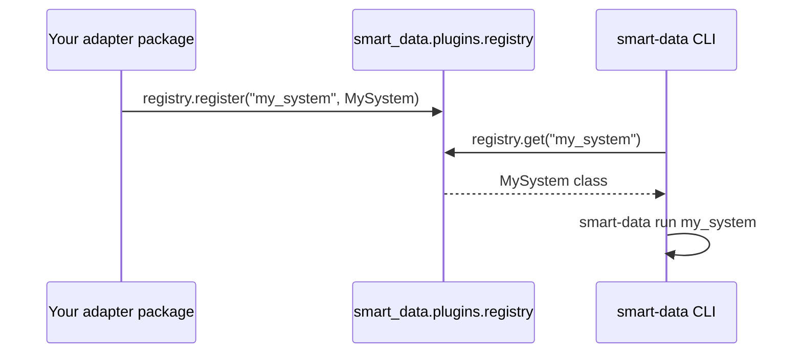

# Plugins & Registry

The plugin registry lets external packages register concrete system
implementations so the CLI can discover and instantiate them by name —
without any changes to the `smart-data` core.

---

## How it works



---

## Registering a system

```python
# my_package/systems.py
from pydantic.dataclasses import dataclass as pydantic_dataclass
from smart_data.core import BaseSystem, IFlow
from smart_data.plugins import registry


@pydantic_dataclass
class SalesSystem(BaseSystem):
    def __post_init__(self) -> None:
        self._flows: list[IFlow] = []

    def register_flow(self, flow: IFlow) -> None:
        self._flows.append(flow)

    def run(self) -> None:
        for flow in self._flows:
            flow.run([])


# Register at import time so the CLI can find it
registry.register("sales_system", SalesSystem)
```

Then run it:

```bash
smart-data run sales_system --env prod
```

---

## Auto-discovery with entry points

You can auto-register systems when your package is installed by declaring a
`smart_data.systems` entry-point group in your `pyproject.toml`:

```toml
[tool.poetry.plugins."smart_data.systems"]
sales_system = "my_package.systems:SalesSystem"
```

!!! note
    Built-in entry-point auto-discovery is planned for a future release.
    For now, call `registry.register()` explicitly at import time.

---

## `_SystemRegistry` API

::: smart_data.plugins._SystemRegistry

---

## Global singleton

::: smart_data.plugins.registry
