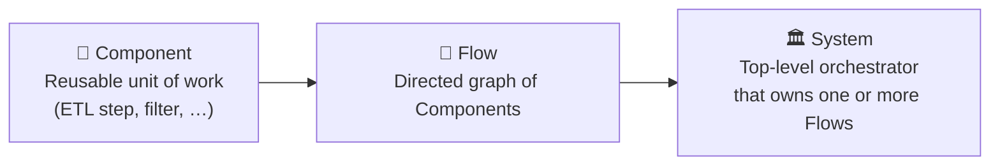
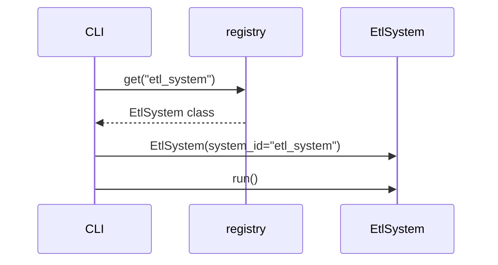
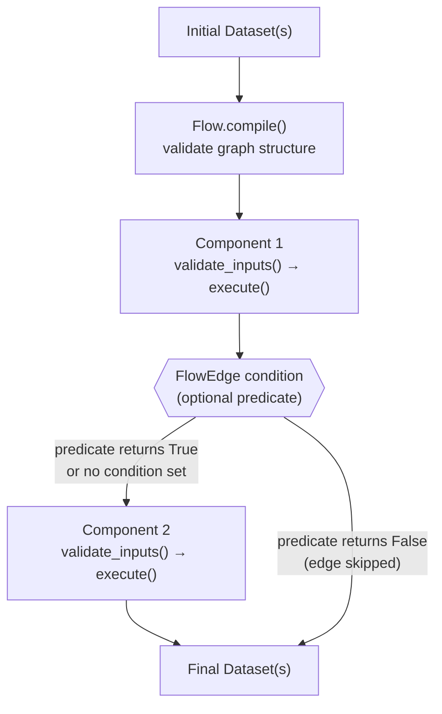

# Architecture

!!! info "Architecture Decision Records"
    For historical context and reasoning behind architectural choices, please refer to the ADRs:

    * [ADR 001: Revisão Arquitetural do Core e Simplificação de Fluxos (DX)](ADR-001-Revisao-Arquitetural-Core.md)

aptdata is built around a **two-layer contract system** for each of its
three universal abstractions — **Component**, **Flow**, and **System** — plus
the foundational **Dataset** type.

---

## The three-abstraction model



---

## The two layers


---

## Layer 1 – `I*` interfaces

Each `I*` class is a plain Python `@dataclass` that also inherits from `ABC`.
It declares **only abstract methods** — no fields, no implementation.

```python
from abc import ABC, abstractmethod
from dataclasses import dataclass
from typing import Any

@dataclass
class IDataset(ABC):
    @abstractmethod
    def read(self) -> Any: ...

    @abstractmethod
    def write(self, data: Any) -> None: ...
```

**Why dataclasses?**

- Standard-library, zero external dependencies for the interface layer.
- ABCMeta enforcement: instantiating an `I*` class directly raises `TypeError`.
- IDE-friendly: tools understand `@dataclass` semantics.

---

## Layer 2 – `Base*` classes

Each `Base*` class uses Pydantic's `@pydantic_dataclass` decorator and
inherits from the corresponding `I*` interface.  It adds **validated fields**
but still does not implement the abstract methods.

```python
from pydantic.dataclasses import dataclass as pydantic_dataclass
from dataclasses import field
from typing import Any

@pydantic_dataclass
class BaseDataset(IDataset):
    uri: str
    schema_metadata: dict[str, Any] = field(default_factory=dict)
```

---

## Concrete implementations

Users inherit from the `Base*` classes and implement the remaining abstract
methods:

```python
from pydantic.dataclasses import dataclass as pydantic_dataclass
from aptdata.core import BaseDataset, IDataset

@pydantic_dataclass
class ParquetDataset(BaseDataset):
    def __post_init__(self) -> None:
        self._df = None

    def read(self):
        import pandas as pd
        self._df = pd.read_parquet(self.uri)
        return self._df

    def write(self, data) -> None:
        data.to_parquet(self.uri, index=False)
        self._df = data
```

!!! tip "Private state"
    Use `__post_init__` to initialise private attributes.  Pydantic validates
    only the declared dataclass fields; everything assigned in `__post_init__`
    is treated as a plain Python attribute.

---

## ComponentMeta & ComponentKind

Every `BaseComponent` carries a `ComponentMeta` instance that describes its
role, tags and branching behaviour:

```python
from aptdata.core import ComponentMeta, ComponentKind

meta = ComponentMeta(
    kind=ComponentKind.TRANSFORM,
    tags=["etl", "prod"],
    branch_on="status",          # field name used for conditional routing
    description="Doubles values",
    extra={"owner": "team-a"},
)
```

`ComponentKind` values: `TRANSFORM`, `FILTER`, `AGGREGATE`, `EXTRACT`,
`LOAD`, `CUSTOM`.

---

## Flow graph primitives

`FlowEdge` connects two components and can carry an optional predicate to
enable conditional / branching execution:

```python
from aptdata.core import FlowEdge

# Unconditional edge
FlowEdge(source_id="extract", target_id="transform")

# Conditional edge – only traversed when the predicate returns True
FlowEdge(source_id="transform", target_id="load",
         condition=lambda outputs: len(outputs) > 0)
```

`FlowNode` wraps a component inside a flow and keeps a back-reference to the
owning `IFlow`.

---

## Plugin registry

Concrete system implementations are registered by name in the global
`registry` singleton:

```mermaid
graph LR
    R["aptdata.plugins.registry"]
    R --> E["\"etl_system\" → EtlSystem"]
    R --> M["\"ml_system\" → MlSystem"]
    R --> D["\"...\""]
```

The CLI calls `registry.get(name)` to resolve a name to a class, instantiates
it with `system_id=name`, and calls `run()`.



---

## Data-flow through a system



Each component validates its own inputs, executes its transformation, and
returns a **list** of datasets (enabling multi-output / branching flows).
When a `FlowEdge` has no condition, it is always traversed.

---

## Monitoring (TUI)

The `aptdata monitor` command launches a
[Textual](https://textual.textualize.io/)-based terminal dashboard that
displays:

- An ASCII representation of the flow graph.
- A per-component status table (pending / running / done).
- A memory-usage bar (uses `psutil` when available, falls back to
  `/proc/meminfo`).
