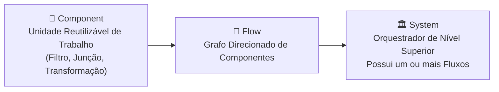
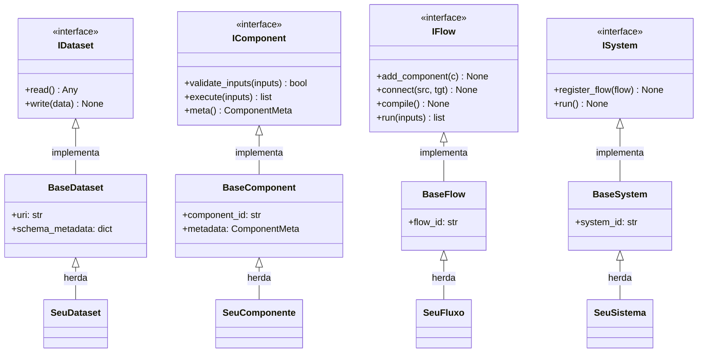
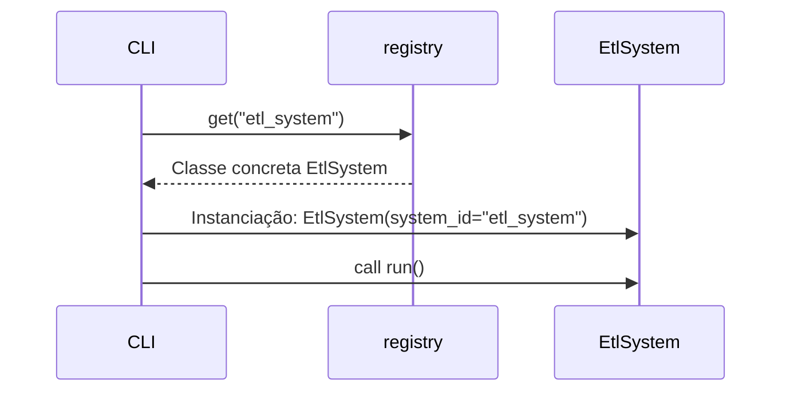

# Arquitetura (Architecture)

!!! info "Architecture Decision Records (ADRs)"
    Para contexto histórico e razões pelas quais essas escolhas de design foram feitas, consulte as ADRs:

    * [ADR 001: Revisão Arquitetural do Core e Simplificação de Fluxos (DX)](ADR-001-Revisao-Arquitetural-Core.md)

O **aptdata** foi projetado com base em um sistema de contrato de duas camadas para cada uma de suas três abstrações fundamentais — **Component**, **Flow**, e **System** — e para o seu tipo fundamental **Dataset**.

---

## O Modelo de Três Abstrações



---

## O Sistema de Duas Camadas



---

## Camada 1 – Interfaces `I*`

Cada classe `I*` é um `@dataclass` puramente Python que herda de `ABC` (Abstract Base Class). Ela declara **apenas os métodos abstratos**, sem conter campos de dados ou lógica de implementação. Qualquer método decorado com `@abstractmethod` no framework dispara um `NotImplementedError` se for invocado diretamente, forçando a aderência rigorosa ao contrato.

```python
from abc import ABC, abstractmethod
from dataclasses import dataclass
from typing import Any

@dataclass
class IDataset(ABC):
    @abstractmethod
    def read(self) -> Any:
        raise NotImplementedError

    @abstractmethod
    def write(self, data: Any) -> None:
        raise NotImplementedError
```

!!! success "Por que Dataclasses na Interface?"
    - Zero dependências externas no core da biblioteca.
    - Cumprimento de Metaclasse via `ABCMeta`. A instanciação de uma interface `I*` gera `TypeError`.
    - Totalmente compatível com ferramentas IDE (Type Hinting, Autocompletes).

---

## Camada 2 – Classes Base (`Base*`)

As classes base (ex: `BaseDataset`, `BaseComponent`) integram Pydantic (via `@pydantic_dataclass`) e herdam da correspondente interface `I*`. Elas injetam **campos validados rigorosamente em tempo de execução**, poupando o usuário de escrever *boilerplate* defensivo em construtores.

```python
from pydantic.dataclasses import dataclass as pydantic_dataclass
from dataclasses import field
from typing import Any

@pydantic_dataclass
class BaseDataset(IDataset):
    uri: str
    schema_metadata: dict[str, Any] = field(default_factory=dict)
```

!!! tip "Dica: Estado Privado"
    Utilize o método especial `__post_init__` para inicializar atributos privados de infraestrutura. O Pydantic valida e mapeia os argumentos na inicialização da classe base, mas os campos configurados no `__post_init__` funcionam como atributos regulares em Python (não sendo checados via schema de input).

---

## ComponentMeta e ComponentKind

Todos os componentes encapsulam os seus atributos não-funcionais num objeto imutável `ComponentMeta`.

=== "Declaração Explicita"

    ```python
    from aptdata.core import ComponentMeta, ComponentKind

    meta = ComponentMeta(
        kind=ComponentKind.TRANSFORM,
        tags=["etl", "prod"],
        branch_on="status",          # Campo utilizado como chave de roteamento condicional
        description="Duplica valores das colunas numéricas",
        extra={"owner": "team-data-eng"},
    )
    ```

=== "Declaração via API Funcional"
    Os *decorators* (`@component`, `@pandas_component`) injetam os metadados de forma opaca em objetos anônimos `FunctionWrapperComponent` sem poluir as funções limpas do usuário.

Valores permitidos para `ComponentKind`: `TRANSFORM`, `FILTER`, `AGGREGATE`, `EXTRACT`, `LOAD`, `CUSTOM`.

---

## Primitivas de Roteamento de Fluxo

As execuções condicionais e as ramificações de pipeline não são resolvidas via "If/Else" nas transformações do código de negócios. Elas são formalizadas pela estrutura `FlowEdge` (Grafo Aresta).

```python
from aptdata.core import FlowEdge

# Aresta Incondicional: sempre será trafegada
FlowEdge(source_id="extract", target_id="transform")

# Aresta Condicional: Somente trafegada quando o predicato é avaliado em True
FlowEdge(
    source_id="transform",
    target_id="load",
    condition=lambda outputs: len(outputs) > 0
)
```

---

## Registry de Plugins (Inversão de Controle da CLI)

Componentes, Flows ou Sistemas não são diretamente invocados pela linha de comando. Para garantir o desacoplamento arquitetural, instâncias concretas são injetadas em um `registry` global nomeado (`ComponentRegistry`).

A CLI resolve internamente os nomes em tempo de execução chamando `registry.get(name)`.



---

## Event Bus e Observabilidade

Para viabilizar monitoramento em tempo real, auditoria e *data lineage* sem misturar métricas de infraestrutura à lógica do domínio (ETL puro), o `aptdata` possui um mecanismo assíncrono **Event Bus**. Esse barramento reside no objeto injetado `IContext` de qualquer fluxo de operação.

Os seguintes hooks de ciclo de vida são emitidos compulsoriamente via `BaseComponent`:

* `pre_execute`
* `on_success`
* `on_failure`
* `post_execute`

Os *payloads* são modelos Pydantic da estrutura `ComponentExecutionEvent`, garantindo serialização segura (`.model_dump_json()`) para agentes MCP ou TUI dashboards. Listeners observadores não podem travar a execução síncrona dos pipelines.

```mermaid
sequenceDiagram
    participant C as BaseComponent
    participant E as EventBus
    participant L as Listener (TUI / MCP)

    C->>E: emit("pre_execute", payload)
    E--)L: async dispatch

    rect rgb(30, 41, 59)
    Note over C: Component.execute(inputs)
    end

    alt Execução com Sucesso
        C->>E: emit("on_success", payload)
        E--)L: async dispatch
    else Execução com Falha
        C->>E: emit("on_failure", error_payload)
        E--)L: async dispatch
    end

    C->>E: emit("post_execute", payload)
    E--)L: async dispatch
```


