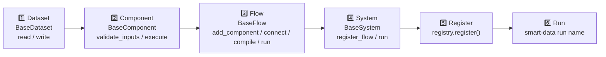

# Getting Started

## Requirements

- Python ≥ 3.10
- [Poetry](https://python-poetry.org/) (recommended) **or** pip

---

## Installation

### From PyPI

```bash
pip install smart-data
```

### Optional extras

```bash
pip install smart-data[pandas]   # pandas support
pip install smart-data[spark]    # PySpark support
pip install smart-data[plugins]  # REST, PostgreSQL, Parquet I/O
pip install smart-data[all]      # everything
```

### From source (development)

```bash
git clone https://github.com/strondata/smart-data.git
cd smart-data
poetry install
```

> **For maintainers:** See the [Release process](https://github.com/strondata/smart-data#release-process)
> section in the README for details on publishing new releases to PyPI.

---

## Verifying the installation

```bash
smart-data --help
```

You should see output like:

```
Usage: smart-data [OPTIONS] COMMAND [ARGS]...

  Smart Data – declarative data-pipeline framework.

Options:
  --help  Show this message and exit.

Commands:
  monitor   Open the interactive TUI monitoring dashboard.
  run       Run a registered data system.
  scaffold  Scaffold a new smart-data project.
```

---

## Building your first system



### 1. Create a dataset

A dataset is a Pydantic-validated dataclass that knows how to read and write
data.  Inherit from [`BaseDataset`](api/core.md) and implement `read` /
`write`:

```python
from pydantic.dataclasses import dataclass as pydantic_dataclass
from smart_data.core import BaseDataset, IDataset


@pydantic_dataclass
class MemoryDataset(BaseDataset):
    """In-memory dataset for testing."""

    def __post_init__(self) -> None:
        self._data = None

    def read(self):
        return self._data

    def write(self, data) -> None:
        self._data = data
```

### 2. Create a component

A component receives a list of `IDataset` objects, validates them and returns
a **list** of `IDataset` outputs (supporting multi-output / branching flows).
Inherit from [`BaseComponent`](api/core.md) and implement `validate_inputs` /
`execute`:

```python
from pydantic.dataclasses import dataclass as pydantic_dataclass
from smart_data.core import BaseComponent, ComponentMeta, ComponentKind, IDataset


@pydantic_dataclass
class DoubleComponent(BaseComponent):
    """Double every numeric value in the input list."""

    def validate_inputs(self, inputs: list[IDataset]) -> bool:
        return len(inputs) == 1

    def execute(self, inputs: list[IDataset]) -> list[IDataset]:
        data = inputs[0].read()
        out = MemoryDataset(uri="memory://output")
        out.write([x * 2 for x in data])
        return [out]
```

Use `ComponentMeta` to annotate the component's role:

```python
comp = DoubleComponent(
    component_id="double",
    metadata=ComponentMeta(kind=ComponentKind.TRANSFORM, tags=["math"]),
)
```

### 3. Create a flow

A flow wires components together in a directed graph.  Inherit from
[`BaseFlow`](api/core.md) and implement `add_component`, `connect`, `compile`
and `run`:

```python
from pydantic.dataclasses import dataclass as pydantic_dataclass
from smart_data.core import BaseFlow, IComponent, IDataset, FlowEdge, FlowNode
from typing import Callable


@pydantic_dataclass
class SimpleFlow(BaseFlow):
    def __post_init__(self) -> None:
        self._nodes: dict[str, FlowNode] = {}
        self._edges: list[FlowEdge] = []
        self._order: list[str] = []

    def add_component(self, c: IComponent) -> None:
        self._nodes[c.component_id] = FlowNode(component=c, flow=self)

    def connect(self, src: str, tgt: str,
                condition: Callable | None = None) -> None:
        self._edges.append(FlowEdge(source_id=src, target_id=tgt,
                                    condition=condition))

    def compile(self) -> None:
        targets = {e.target_id for e in self._edges}
        roots = [cid for cid in self._nodes if cid not in targets]
        queue = list(roots)
        while queue:
            current = queue.pop(0)
            self._order.append(current)
            for e in self._edges:
                if e.source_id == current:
                    queue.append(e.target_id)

    def run(self, inputs: list[IDataset]) -> list[IDataset]:
        outputs = inputs
        for cid in self._order:
            comp = self._nodes[cid].component
            if comp.validate_inputs(outputs):
                outputs = comp.execute(outputs)
        return outputs
```

### 4. Create a system and register it

```python
from pydantic.dataclasses import dataclass as pydantic_dataclass
from smart_data.core import BaseSystem, IFlow
from smart_data.plugins import registry


@pydantic_dataclass
class MySystem(BaseSystem):
    def __post_init__(self) -> None:
        self._flows: list[IFlow] = []

    def register_flow(self, flow: IFlow) -> None:
        self._flows.append(flow)

    def run(self) -> None:
        ds = MemoryDataset(uri="memory://input")
        ds.write([1, 2, 3])
        inputs = [ds]
        for flow in self._flows:
            inputs = flow.run(inputs)


# my_systems.py
registry.register("my_system", MySystem)
```

### 5. Run via the CLI

```bash
smart-data run my_system
```

Expected output:

```json
{"event": "pipeline.started", "pipeline": "my_system", "env": "dev", "dry_run": false}
{"event": "pipeline.completed", "pipeline": "my_system", "env": "dev", "dry_run": false, "elapsed_seconds": 0.001}
```

---

## CLI options

### `smart-data run`

| Option | Default | Description |
|---|---|---|
| `name` | *(required)* | System name registered in the plugin registry |
| `--env`, `-e` | `dev` | Target execution environment label |
| `--dry-run` | `false` | Instantiate without calling `run()` |

### `smart-data monitor`

| Option | Default | Description |
|---|---|---|
| `--refresh`, `-r` | `1.0` | Dashboard auto-refresh interval (seconds) |

---

## Running the test suite

```bash
make test
# or
poetry run pytest tests/ -v
```

---

## AI Agent Integration

smart-data ships with a built-in [Model Context Protocol](https://modelcontextprotocol.io/) (MCP) server,
allowing AI agents such as **Claude Desktop**, **Copilot**, or **Devin** to
discover and execute pipelines without consuming excessive context tokens.

### Starting the MCP server

```bash
# Default (stdio transport – used by most desktop AI agents)
smart-data mcp-start

# SSE transport (for web-based integrations)
smart-data mcp-start --transport sse
```

### Connecting Claude Desktop

Add the following to your Claude Desktop `config.json` (typically
`~/Library/Application Support/Claude/claude_desktop_config.json` on macOS
or `%APPDATA%\Claude\claude_desktop_config.json` on Windows):

```json
{
  "mcpServers": {
    "smart-data": {
      "command": "smart-data",
      "args": ["mcp-start"]
    }
  }
}
```

Once connected, the agent can:

| MCP Tool | Description |
|---|---|
| `run_flow(flow_id)` | Execute a registered system and get status |
| `list_registered_systems()` | Discover available pipelines |

The agent can also read dataset metadata via the `schema://datasets/{name}`
resource URI.

### AI-friendly documentation

For AI tools that support the `llms.txt` standard, we provide:

- [`docs/llms.txt`](llms.txt) — high-level framework overview
- [`docs/llms-full.txt`](llms-full.txt) — consolidated full documentation
