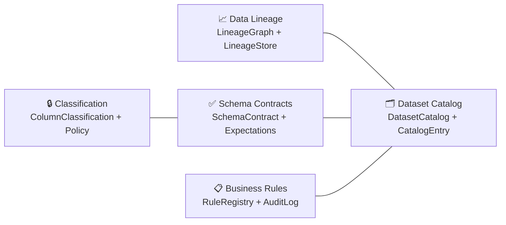
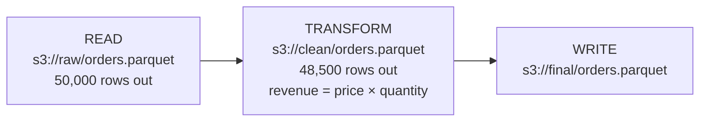

# Governance

aptdata ships a first-class governance layer that covers:

- **Data lineage** — provenance graph tracking every read, transform, and write
- **Data quality & contracts** — schema contracts and expectation suites
- **Business rules registry** — versioned rule catalogue with audit logging
- **Dataset catalog** — searchable metadata store for every dataset
- **Data classification** — sensitivity policies (PII, PHI, CONFIDENTIAL, …)



---

## Data Lineage

### Overview

The lineage subsystem lives in `aptdata.core.lineage`.  Every workflow run
produces a :class:`~aptdata.core.lineage.LineageGraph` that contains an
ordered list of :class:`~aptdata.core.lineage.LineageNode` objects.



```python
from aptdata.core.lineage import (
    ColumnLineage,
    LineageEventType,
    LineageGraph,
    LineageNode,
)

# Build a graph for a workflow run
graph = LineageGraph(run_id="run-20240101", workflow_name="etl_pipeline")

read_node = LineageNode(
    dataset_uri="s3://raw/orders.parquet",
    event_type=LineageEventType.READ,
    workflow_name="etl_pipeline",
    rows_out=50_000,
)
graph.add_node(read_node)

transform_node = LineageNode(
    dataset_uri="s3://clean/orders.parquet",
    event_type=LineageEventType.TRANSFORM,
    engine="pandas",
    rows_in=50_000,
    rows_out=48_500,
    parent_node_ids=[read_node.node_id],
    column_lineage=[
        ColumnLineage(
            target_column="revenue",
            source_columns=["price", "quantity"],
            transformation="price * quantity",
        )
    ],
)
graph.add_node(transform_node)

# Navigate the graph
upstream = graph.get_upstream(transform_node.node_id)   # → [read_node]
downstream = graph.get_downstream(read_node.node_id)    # → [transform_node]

# Serialise
d = graph.to_dict()  # plain dict, JSON-serialisable
```

### Lineage Store

Use :class:`~aptdata.plugins.governance.lineage_store.LineageStore` to
persist and query graphs in memory across a session.

```python
from aptdata.plugins.governance import LineageStore

store = LineageStore()
store.save(graph)

loaded = store.load("run-20240101")
runs   = store.list_runs()
graphs = store.query_by_dataset("s3://raw/orders.parquet")
```

---

## Business Rules Registry

```python
from aptdata.plugins.governance import (
    BusinessRule,
    RuleAuditEntry,
    RuleRegistry,
    RuleStatus,
)

registry = RuleRegistry()

# Register a rule
registry.register(BusinessRule(
    rule_id="BR-001",
    name="Revenue must be positive",
    owner="finance-team",
    expression="revenue > 0",
    tags=["finance", "revenue"],
))

# Retrieve
rule = registry.get("BR-001")

# List with filters
finance_rules = registry.list_rules(tag="finance")
owned_rules   = registry.list_rules(owner="finance-team")

# Audit logging
registry.record_audit(RuleAuditEntry(
    rule_id="BR-001",
    status=RuleStatus.APPLIED,
    workflow_name="etl_pipeline",
    trace_id="abc123",
    rows_affected=48_500,
))

log = registry.get_audit_log(rule_id="BR-001")
```

---

## Dataset Catalog

```python
from aptdata.plugins.governance import DatasetCatalog, DatasetCatalogEntry
from aptdata.plugins.governance.classification import ColumnClassification

catalog = DatasetCatalog()

catalog.register(DatasetCatalogEntry(
    uri="s3://datalake/orders.parquet",
    name="Orders",
    description="Customer order records from the OLTP system.",
    owner="data-engineering",
    tags=["orders", "finance"],
    classification=ColumnClassification.CONFIDENTIAL,
))

# Retrieve
entry = catalog.get("s3://datalake/orders.parquet")

# Search
results = catalog.search(owner="data-engineering", tag="finance")
```

---

## Data Classification

```python
from aptdata.plugins.governance.classification import (
    ColumnClassification,
    DataClassificationPolicy,
)

policy = DataClassificationPolicy(
    name="GDPR PII Policy",
    description="Controls for columns containing personal data.",
    pii_columns=["email", "phone", "full_name"],
    retention_days=365,
    encryption_required=True,
    access_roles=["data-engineers", "privacy-team"],
)
```

### Classification Levels

| Level          | Description                        |
|----------------|------------------------------------|
| `PUBLIC`       | Freely shareable                   |
| `INTERNAL`     | Internal use only                  |
| `CONFIDENTIAL` | Restricted; need-to-know basis     |
| `PII`          | Personally identifiable information |
| `PHI`          | Protected health information       |
| `FINANCIAL`    | Financial / payment data           |
| `SENSITIVE`    | Catch-all for sensitive data       |

---

## Schema Contracts

Schema contracts (see [Quality](quality.md)) integrate with the catalog:

```python
from aptdata.plugins.quality import ColumnClassification, ColumnContract, SchemaContract
from aptdata.plugins.governance import DatasetCatalog, DatasetCatalogEntry

contract = SchemaContract(
    name="orders_v1",
    version="1.0.0",
    owner="data-engineering",
    columns=[
        ColumnContract(name="id",    dtype="int64", nullable=False),
        ColumnContract(name="email", dtype="str",   nullable=False, pii=True,
                       classification=ColumnClassification.PII),
    ],
)

catalog = DatasetCatalog()
catalog.register(DatasetCatalogEntry(
    uri="s3://datalake/orders.parquet",
    name="Orders",
    schema_contract=contract,
))

# Retrieve PII columns from the contract
pii_cols = contract.get_pii_columns()
```
