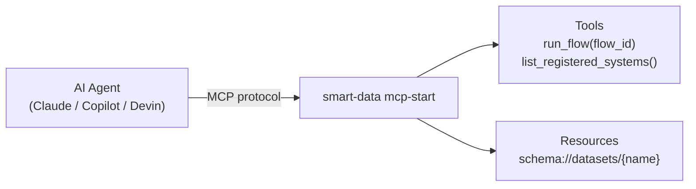

# MCP Server

smart-data ships a built-in [Model Context Protocol](https://modelcontextprotocol.io/)
(MCP) server so AI agents — Claude Desktop, GitHub Copilot, Devin, and others
— can discover and execute your pipelines without consuming excessive context
tokens.

---

## Overview

The MCP server is powered by [FastMCP](https://github.com/jlowin/fastmcp) and
exposes your registered systems as callable **tools** and your dataset schemas
as **resources**.



---

## Starting the server

### stdio transport (default)

Used by most desktop AI agents (Claude Desktop, Continue.dev, etc.):

```bash
smart-data mcp-start
```

### SSE transport

For web-based or HTTP integrations:

```bash
smart-data mcp-start --transport sse
```

---

## Available tools

| Tool | Signature | Description |
|------|-----------|-------------|
| `run_flow` | `run_flow(flow_id: str)` | Execute a registered system by name and return its status |
| `list_registered_systems` | `list_registered_systems()` | Return a list of all systems registered in the plugin registry |
| `list_available_plugins` | `list_available_plugins()` | List all installed plugins |
| `get_plugin_schema` | `get_plugin_schema(plugin_name: str)` | Return the JSON schema for a plugin |
| `preview_dataset` | `preview_dataset(reader: str, limit: int)` | Preview the first N rows from a dataset reader |

---

## Available resources

| URI pattern | Description |
|-------------|-------------|
| `schema://datasets/{name}` | JSON schema for the named dataset |

---

## Integrating with Claude Desktop

Add the following to your Claude Desktop configuration file:

- **macOS:** `~/Library/Application Support/Claude/claude_desktop_config.json`
- **Windows:** `%APPDATA%\Claude\claude_desktop_config.json`

```json
{
  "mcpServers": {
    "smart-data": {
      "command": "smart-data",
      "args": ["mcp-start"]
    }
  }
}
```

Restart Claude Desktop.  The agent will now be able to call
`list_registered_systems()` to discover your pipelines and `run_flow()`  to
execute them.

---

## Integrating with other agents

Any MCP-compatible client can connect to smart-data.  For agents that support
SSE, start the server with `--transport sse` and point the client at
`http://localhost:8000/sse` (default port).

---

## Further reading

- [Getting Started](getting-started.md) — register your first system
- [API Reference – Core](api/core.md) — `BaseSystem` and the plugin registry
- [Model Context Protocol specification](https://modelcontextprotocol.io/docs)
