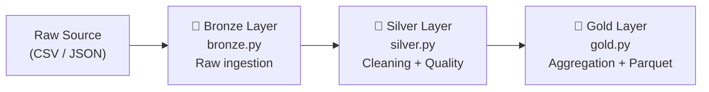
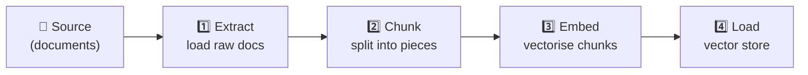
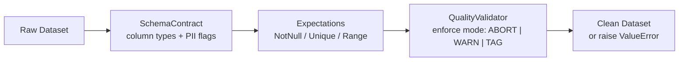

# Scaffold Templates

The `aptdata scaffold` command bootstraps a project from a pre-built template.

```bash
aptdata scaffold <project-name> [--template TEMPLATE] [--output DIR]
```

| Option          | Default        | Description                          |
|-----------------|----------------|--------------------------------------|
| `project-name`  | *required*     | Must match `[A-Za-z][A-Za-z0-9_]*`  |
| `--template`/`-t` | `hello-world`  | Template to generate                 |
| `--output`/`-o`   | `.`            | Parent directory for the new project |

---

## Available Templates

### `hello-world` (default)

A minimal pandas pipeline that ingests a JSON file, processes it, and saves
CSV/JSON output.  Great for getting started.

```bash
aptdata scaffold my_project
```

**Generated files:**

```
my_project/
├── data/
│   └── selecao_brasileira.json
├── output/
├── main.py
├── requirements.txt
└── README.md
```

---

### `medallion`

A three-layer Bronze → Silver → Gold data lakehouse pattern.

```bash
aptdata scaffold my_lakehouse --template medallion
```



**Generated files:**

```
my_lakehouse/
├── data/
├── output/
├── bronze.py           # Raw ingestion (CSVReader)
├── silver.py           # Cleaning + PandasTransformer + QualityValidator
├── gold.py             # Aggregation + ParquetWriter
├── aptdata.yaml     # Connector config
├── requirements.txt
└── README.md
```

The Silver layer demonstrates wiring a
:class:`~aptdata.plugins.transform.pandas.PandasTransformer` with a
:class:`~aptdata.plugins.quality.validator.QualityValidator` inside a
:class:`~aptdata.core.workflow.Workflow`.

---

### `rag-ingestion`

An end-to-end Retrieval-Augmented Generation (RAG) ingestion pipeline:
extract → chunk → embed → load.

```bash
aptdata scaffold my_rag_app --template rag-ingestion
```



**Generated files:**

```
my_rag_app/
├── data/
├── pipeline.py         # 4-step Workflow (extract/chunk/embed/load)
├── aptdata.yaml
├── requirements.txt
└── README.md
```

Replace the `embed` step with your chosen embedding provider (OpenAI,
Sentence-Transformers, etc.) and the `load_to_vector_store` step with your
vector database client.

---

### `data-quality-test`

A data quality enforcement pipeline using
:class:`~aptdata.plugins.quality.contract.SchemaContract` and expectations.

```bash
aptdata scaffold my_dq_suite --template data-quality-test
```



**Generated files:**

```
my_dq_suite/
├── data/
├── quality_pipeline.py  # SchemaContract + QualityValidator + Workflow
├── aptdata.yaml
├── requirements.txt
└── README.md
```

Modify the contract columns and expectations to match your dataset, then run:

```bash
python quality_pipeline.py
```

---

### `job-wheel`

A Python wheel executor template for packaging and running jobs portably.

```bash
aptdata scaffold my_job --template job-wheel
```

**Generated files:**

```
my_job/
├── src/
│   └── my_job/
│       ├── __init__.py
│       └── job.py          # Job logic + CLI entry-point
├── dist/                   # Built wheel artifacts
├── pyproject.toml          # Packaging metadata (setuptools + wheel)
├── mesh.yaml               # Component descriptor (type: job-wheel)
├── Makefile
└── README.md
```

The generated `job.py` exposes a `run(config)` function and a `main()` CLI
entry-point wired via `pyproject.toml [project.scripts]`.  Build and run with:

```bash
# Build the wheel
make build        # or: pip wheel . -w dist/ --no-deps

# Install and execute
make install      # pip install dist/my_job-*.whl
my_job-job

# Or run directly
aptdata mesh run my_job
```

---

### `docker-compose-app`

A multi-service Docker Compose application template.

```bash
aptdata scaffold my_service --template docker-compose-app
```

**Generated files:**

```
my_service/
├── data/                   # Mounted data directory
├── app.py                  # Application service entry-point
├── Dockerfile              # Container image definition
├── docker-compose.yml      # Service orchestration
├── mesh.yaml               # Component descriptor (type: docker-compose-app)
├── requirements.txt
└── README.md
```

Add more services (databases, caches, queues) to `docker-compose.yml` and run:

```bash
docker compose up --build

# Or via the mesh CLI
aptdata mesh run my_service
```

---

## Mesh CLI

The `aptdata mesh` sub-command orchestrates components that include a
`mesh.yaml` descriptor.

```bash
# List all mesh components under the current directory
aptdata mesh list [--dir DIR] [--json]

# Run a component (job-wheel or docker-compose-app)
aptdata mesh run COMPONENT [--dir DIR] [--dry-run] [--json]

# Build a component (wheel or Docker image)
aptdata mesh build COMPONENT [--dir DIR] [--json]
```

### Supported component types

| Type                | Run command                 | Build command             |
|---------------------|-----------------------------|---------------------------|
| `job-wheel`         | Invokes the wheel entrypoint | `pip wheel .`            |
| `docker-compose-app`| `docker compose up`         | `docker compose build`   |

---

## Machine-readable output

All scaffold events are emitted as JSON lines:

```json
{"event": "scaffold.started", "project": "my_project", "template": "medallion", "output": "/..."}
{"event": "scaffold.completed", "project": "my_project", "template": "medallion", "path": "/..."}
```

Error events are written to stderr with `exit code 1`:

```json
{"event": "scaffold.error", "project": "...", "error": "Directory already exists: ..."}
```
