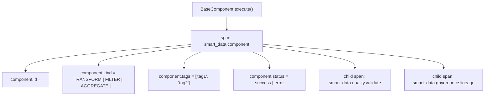

# Telemetry

smart-data integrates [OpenTelemetry](https://opentelemetry.io/) to give you
automatic, zero-configuration observability for every pipeline execution.

---

## Overview

Every `BaseComponent` subclass is **auto-instrumented** via `__init_subclass__`.
Whenever `execute()` is called, the framework wraps the call in an
OpenTelemetry span carrying rich component metadata.  No code changes to your
components are needed.



Data-quality validators and governance hooks emit their own child spans so you
get end-to-end trace visibility across the entire pipeline.

---

## CLI commands

### `telemetry status`

Display the current OpenTelemetry configuration:

```bash
smart-data telemetry status
smart-data telemetry status --json
```

**Example output (Rich):**

```
┌──────────────────────────────────────┐
│ Telemetry Status                     │
├─────────────────────┬────────────────┤
│ Exporter            │ console        │
│ Service name        │ smart-data     │
│ SDK version         │ 1.x.x          │
│ Status              │ active         │
└─────────────────────┴────────────────┘
```

### `telemetry export`

Flush and export collected spans:

```bash
smart-data telemetry export
smart-data telemetry export --format json
```

---

## Auto-instrumented spans

| Span name | Emitted by | Key attributes |
|-----------|-----------|----------------|
| `smart_data.component` | `BaseComponent.execute()` | `component.id`, `component.kind`, `component.tags` |
| `smart_data.quality.validate` | `QualityValidator.validate()` | `quality.rule_count`, `quality.enforcement` |
| `smart_data.governance.lineage` | `LineageStore.save()` | `lineage.run_id`, `lineage.workflow` |
| `smart_data.transform` | `PandasTransformer` / `PySparkTransformer` | `transform.engine`, `transform.rows_in`, `transform.rows_out` |

---

## Integrating with a backend

### Jaeger (local development)

Start Jaeger via Docker:

```bash
docker run -d --name jaeger \
  -p 16686:16686 \
  -p 4317:4317 \
  jaegertracing/all-in-one:latest
```

Configure smart-data via environment variables:

```bash
export OTEL_EXPORTER_OTLP_ENDPOINT=http://localhost:4317
export OTEL_SERVICE_NAME=smart-data
smart-data run my_system
```

Open `http://localhost:16686` to explore traces.

### OTLP (production)

Point the exporter at any OTLP-compatible collector (Grafana Tempo, Honeycomb,
Datadog, etc.):

```bash
export OTEL_EXPORTER_OTLP_ENDPOINT=https://api.honeycomb.io
export OTEL_EXPORTER_OTLP_HEADERS="x-honeycomb-team=<API_KEY>"
export OTEL_SERVICE_NAME=smart-data
smart-data run my_system
```

---

## Disabling telemetry

Set the standard OpenTelemetry SDK variable to suppress all spans:

```bash
export OTEL_SDK_DISABLED=true
smart-data run my_system
```

---

## Further reading

- [OpenTelemetry Python SDK](https://opentelemetry-python.readthedocs.io/)
- [Transform Engines](transform-engines.md) — span attributes for transformers
- [Data Quality](quality.md) — span attributes for quality validators
